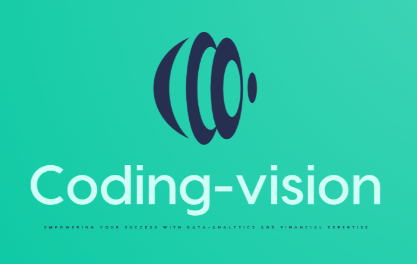

<!------ <!DOCTYPE html> ---->
<html lang="en">
<!------Here main body starts  ------->
<body>

    <h1>About us</h1>
    
<!---src - Specifies the path to the image
alt - Specifies an alternate text for the image

This is header subtitle.
--->
  

  

  
    
    

    <a href="https://github.com/arunsinp">GitHub</a>
    <a href="#">Your codes</a>
    <a href="#">Photos</a>
    <a href="#" class="right">Link for something</a>
  

  
 

    

<h2>About Me</h2>

<!-------     

----->
# Business Analytics Solutions and Tech Support
        
Welcome to our world! We are a dynamic company specializing in providing cutting-edge data analytics solutions and comprehensive tech support for businesses of all sizes.
        
# Our Services

- **Data Analytics Solutions:** We offer advanced data analysis techniques and tools to extract meaningful insights from your business data. Leverage our expertise in statistical analysis, machine learning, and data visualization to make informed decisions and drive growth.
        
- **Tech Support:** Our team of experienced professionals is dedicated to providing reliable and efficient tech support. From software installation and configuration to troubleshooting and system optimization, we ensure that your technology infrastructure runs smoothly and seamlessly.

# Why Choose Us
        
- **Expertise:** Our team consists of highly skilled data analysts and tech support specialists who have a deep understanding of industry best practices and the latest technologies. We stay updated with the rapidly evolving trends in data analytics and tech support to deliver exceptional results.

        - 
        
<!-------Add your photos here, if you wish -->

     

     <h1>Technical Skills<h1/>

<h3>Programming Skills</h3>

Python

  

Machine-learning

  

Gnuplot

  

Fortran

  

HTML

  

SWIFT

  

<h3>Tools and Softwares </h3>

GIT

  

Mathematica

  

Latex

  

MS Excel

  

SQL

  

Power BI

  

Tableau

  

  
  

    <h4>This website is managed by yourname or email id</h4>
  

<!------Here main body ends  ------->
</body>
<!---------------------------Here html page ends ---------------------------------->
